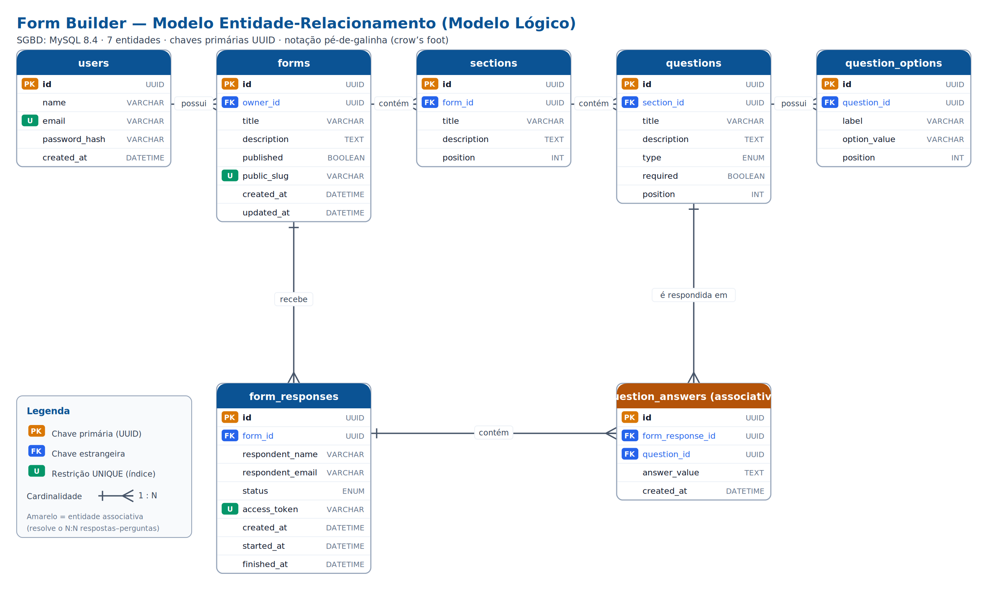

<h1 align="center">Construtor de Formulários</h1>

<p align="center">
  Este é um clone de estudo do Google Forms feito com Java Spring Boot & TypeScript com React.
</p>

<p align="center">
  
  
  
  
</p>

---

## Sumário

- [Da Solução](#-da-solucao)
- [Estrutura do Repositório](#-estrutura-do-repositorio)
- [Stacks Escolhidas](#-stacks-escolhidas)
- [Configuração](#-configuracao)
- [Como rodar?](#-como-rodar)
- [Contribuições](#-contribuicoes)
- [Licença](#-licenca)

---

## Da Solução

Esse repositório fornece uma aplicação inspirada no Google Forms para estudos pessoais.
A ideia era apresentar um MVP que pudesse cumprir o mínimo existente no Google Forms, sendo uma estrutura pensada para garantir organização, segurança e flexibilidade na criação de formulários. 

Primeiramente, somente o usuário autenticado pode visualizar os próprios formulários, ou seja, cada usuário acessa apenas aquilo que criou. Claro que este comportamento é diferente do que é ocorre no Google Forms, em que um usuário poderia disponibilizar para outro o acesso e ambos modificarem simultaneamente, porém, isso dependeria de um SSE (Server Send Event, ou, Evento Enviado pelo Servidor) para que alterações acontecessem em tempo real para outros usuários ou uma ligação websocket. Algo que ainda não tenho total compreensão. 

Cada formulário pode conter nenhuma, uma ou várias seções, permitindo que o usuário tenha o máximo de liberdade na organização do conteúdo. Da mesma forma, cada seção pode conter nenhuma, uma ou várias perguntas, mantendo a proposta de oferecer controle total sobre a estrutura e o resultado final do formulário. Corroborando, as perguntas são organizadas a partir de um modelo flexível de tipos, utilizando um enum associado a um submodelo de opções. Esse formato permite definir diferentes tipos de pergunta, como texto, múltipla escolha, caixa de seleção, entre outros, além de possibilitar a inclusão de novos tipos futuramente sem comprometer a lógica já existente no sistema.

Também há uma herança "sucessiva" da separação entre rotas privadas e rotas públicas na comunicação entre backend e frontend. Essa decisão surgiu a partir da observação do funcionamento do Google Forms, especialmente no uso de links públicos gerados por meio de slugs. Dessa forma, o sistema diferencia claramente aquilo que pertence à área autenticada do usuário, como criação, edição e gerenciamento de formulários, daquilo que pode ser acessado externamente por respondentes, como o preenchimento de um formulário publicado. Essa parte foi de muito grande interesse da minha parte, considerando que observei esse "case" enquanto respondia um formulário, o qual pude ter acesso ao modo de edição depois e notar que o mesmo era diferenciado em "entidades" diferentes no momento em que deixava de ser tratado "Formulário" e tornava-se "Avaliação". 

Esse comportamento prévio de personalização e diferenciação em rotas é algo clássico do ecossistema Google, visto que todas as aplicações possuem sempre alguma forma de expor publicamente sem a necessidade do login de um usuário externo. Aparentemente, a dona Google quer que os usuários justamente utilizem suas ferramentas livremente, maneira como faz sentido para eles. Por isso, trouxe essa "cultura" nesta solução.

---

## Estrutura do Repositório

Na estrutura atual, diferencio Back-end de Front-end via, respectivamente, `server` e `web`, trazendo como centralizador "orquestrador" o Docker. Neste caso, inicializando o projeto, baixando as dependências necessárias dentro de cada ambiente individual e gerenciando a conexão e retroalimentação do conteúdo via Dockerfile dentro de cada um dos polos.

---

## Configuração

Crie o arquivo local de ambiente a partir do exemplo:

```bash
cp .env.example .env
```

Revise os valores de `.env` antes de subir os servicos. Esse arquivo contem senhas e secrets locais e nao deve ser commitado.

Suba a aplicacao a partir da raiz:

```bash
docker compose up --build
```

Acessos esperados:

```txt
Frontend: http://localhost:5173
Backend:  http://localhost:8080
MySQL:    localhost:3306
```

## Parar os servicos

```bash
docker compose down
```

Para remover tambem o volume do MySQL, apagando os dados persistidos:

```bash
docker compose down -v
```

## Variaveis de ambiente

As variaveis sensiveis devem ficar apenas no `.env` local. O Compose exige `MYSQL_ROOT_PASSWORD`, `MYSQL_PASSWORD` e `JWT_SECRET` para evitar subir a aplicacao com credenciais implicitas.

---

## Contribuições

Contribuições são muito bem-vendas, principalmente bug-fixes, casos de uso ou abordagens diferenciais.

1. Faça o **fork** e **clone** localmente o repositório.
2. Crie uma **nova branch**:

   ```bash
   git checkout -b minha-branch
   ```
   
4. Faça **commit** suas mudanças:

   ```bash
   git add .
   git commit -m "[feat] adicionando funcionalidade X para o serviço Y"
   ```
   
5. Faça **push** para o seu **fork**:

   ```bash
   git push origin minha-branch
   ```
   
6. Abra um **Pull Request** para a **branch `dev`**, vou avalidar e, passando em minha análise, aprovo!

---

## Modelo de Dados (MER)

O diagrama abaixo representa o modelo lógico do banco de dados (MySQL 8.4), com as sete entidades do domínio, suas chaves e cardinalidades.



O modelo é composto por sete entidades, todas com chave primária `UUID`:

| Entidade | Descrição | Relacionamentos |
|---|---|---|
| **users** | Usuário autenticado, dono dos formulários | 1—N com `forms` |
| **forms** | Formulário criado por um usuário | N—1 `users` · 1—N `sections` |
| **sections** | Seção ordenável dentro de um formulário | N—1 `forms` · 1—N `questions` |
| **questions** | Pergunta de uma seção, com tipo e posição | N—1 `sections` · 1—N `question_options` |
| **question_options** | Opção de resposta (checkbox/seleção) | N—1 `questions` |
| **form_responses** | Uma resposta enviada a um formulário | N—1 `forms` · 1—N `question_answers` |
| **question_answers** | Resposta a uma pergunta específica (entidade associativa) | N—1 `form_responses` · N—1 `questions` |

> A entidade **`question_answers`** é uma tabela associativa que resolve o relacionamento N:N entre `form_responses` e `questions`: uma resposta cobre várias perguntas, e cada pergunta é respondida em várias respostas.

## Licença

Este projeto está regido pela **Licença MIT**. Veja a [licença](LICENSE).
